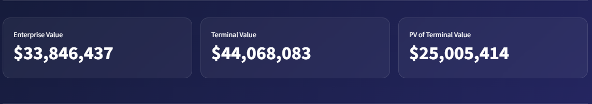
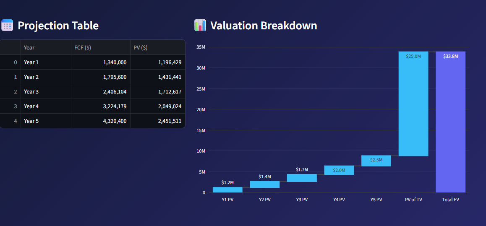
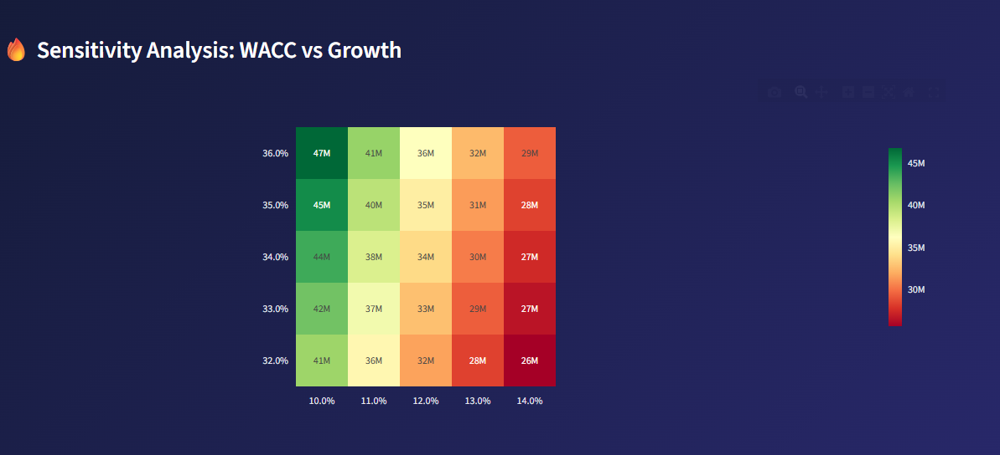

# ⚖️ Valuation-Pro | Strategic Financial Insight Engine

**Valuation-Pro** هو محرك مالي متطور صُمم لربط نظريات المحاسبة العميقة بتحليل البيانات التفاعلي، مخصص للمحللين الماليين في سوق **دبي** لاتخاذ قرارات استثمارية مبنية على أرقام دقيقة.

---
## 📺 Project Walkthrough

  <video src="https://github.com/user-attachments/assets/1f48c58c-b551-400e-b903-6c5f6ccd043f" width="100%" controls>
    Your browser does not support the video tag.
  </video>

---

## 🔍 Methodology
The engine projects future free cash flows and discounts them using the **Weighted Average Cost of Capital (WACC)**.

### The Core Logic:
$$PV = \sum_{t=1}^{n} \frac{CF_t}{(1+r)^t}$$

---

## 🛠️ Key Capabilities

### 📊 Model Assumptions

### 💎 Valuation Metrics

### 📈 Waterfall Analysis

### 🔥 Risk & Sensitivity Analysis

---

## 👤 Developer
**Maher Al-Momani** | **CMA Candidate** | **Dubai, UAE** 🇦🇪
